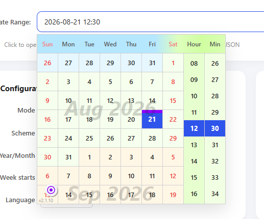

# dtrPicker

> 一个流式日期/时间范围选择器组件，基于 SVG 渲染，专注于轻量、流畅与可定制。

<!-- 截图：运行 `node server.js` 后打开 http://localhost:16800/，截取选择器弹出界面，保存为 docs/screenshots/picker.png -->


---

## 功能特性

- **四种选择模式** — `date` / `dateTime` / `dateRange` / `dateTimeRange`
- **SVG 渲染** — 像素级精确控制，CSS 隔离，不依赖外部 UI 框架
- **虚拟滚动** — 日历面板流畅翻页，支持滚轮与拖拽浏览
- **国际化** — 内置多语言包（简体中文、英语、日语等），BCP 47 语言标签
- **多色系** — 莫兰迪 / 自然 / 海天蓝 / 森林绿 / 星夜黑，支持自定义颜色覆盖
- **TypeScript 支持** — 完整类型声明
- **零运行时依赖** — 仅构建时依赖 esbuild

---

## 快速开始

```bash
npm install dtrpicker
```

```js
import dtrPicker from 'dtrpicker';

// 1. 创建实例
const picker = new dtrPicker('#my-input', {
  mode: 'dateRange',
  locale: 'zh-CN',
  firstDay: 1,
  colorScheme: 'nature',
});

// 2. 监听值变更
//    注意：`value` 是一个对象 `{ start, end }`（字段为 `YYYY-MM-DD`
//    或 `YYYY-MM-DD HH:mm` 字符串），并非单个字符串，请用
//    `value.start` / `value.end` 展示。
picker.onChange((value, meta) => {
  if (value) {
    console.log(`选中范围：${value.start} ~ ${value.end}`);
  }
  console.log('变更来源：', meta.source, '动作：', meta.action);
});

// 3. 面板开关通知
picker.onOpen(() => console.log('面板已打开'));
picker.onClose(() => console.log('面板已关闭'));

// 4. 程序化操作
picker.setValue({ start: '2026-07-01', end: '2026-07-10' });
const val = picker.getValue('date');
console.log(val.start.getFullYear()); // 2026

// 5. 清理
picker.destroy();
```

### 直接使用 `<script>` 引入（CDN）

无需构建步骤——直接引入 IIFE 产物并使用全局 `dtrPicker`：

```html
<script src="https://unpkg.com/dtrpicker@2.2.2/dist/dtrpicker.iife.js"></script>
<script>
  const picker = new dtrPicker('#my-input', {
    mode: 'dateRange',
  });
</script>
```

也可通过 [jsDelivr](https://cdn.jsdelivr.net/npm/dtrpicker@2.2.2/dist/dtrpicker.iife.js) 引入。

---

## 安装与引入

### ESM（推荐）

```js
import dtrPicker from 'dtrpicker';
```

### CommonJS

```js
const dtrPicker = require('dtrpicker').default;
```

### `<script>` 标签 / CDN（IIFE）

```html
<script src="dist/dtrpicker.iife.js"></script>
<script>
  const picker = new dtrPicker('#my-input', { mode: 'dateRange' });
</script>
```

---

## API 参考

### 构造与选项

```js
const picker = new dtrPicker(trigger, options);
```

| 参数 | 类型 | 默认值 | 必填 | 说明 |
| --- | --- | --- | --- | --- |
| `trigger` | `HTMLElement \| string` | — | ✅ | 触发器元素或其 CSS 选择器，作为面板定位锚点与点击开关 |
| `options` | `Object` | `{}` | — | 配置对象 |
| `options.mode` | `string` | — | ✅ | 选择模式：`'date'` / `'dateTime'` / `'dateRange'` / `'dateTimeRange'` |
| `options.yearMonthMode` | `'watermark' \| 'column'` | `'watermark'` | — | 年月显示方式：`'watermark'` 水印叠加 / `'column'` 独立列 |
| `options.locale` | `string` | `''` | — | BCP 47 语言标签（`'zh-CN'` / `'en-US'` / `'ja-JP'` 等），空串自动检测浏览器语言 |
| `options.firstDay` | `0 \| 1` | `0` | — | 每周起始日：`0`=周日，`1`=周一 |
| `options.colorScheme` | `string` | `'morandi'` | — | 色系：`'morandi'` / `'nature'` / `'ocean'` / `'forest'` / `'night'` |
| `options.todayBarHeight` | `number` | `6` | — | 今日标记条高度（px） |
| `options.wheelStep` | `number` | `40` | — | 滚轮翻页步进系数 |

> ⚠️ `mode`、`yearMonthMode`、`locale`、`firstDay`、`colorScheme` **构造后不可修改**。

颜色选项：

| 参数 | 默认值（morandi） | 说明 |
| --- | --- | --- |
| `selectedColor` | `'#2f54eb'` | 选中/高亮颜色 |
| `selectedTextColor` | `'#ffffff'` | 选中态文字颜色 |
| `gridColor` | `'#d0d0d0'` | 网格线颜色 |
| `cellColor` | `'#ffffff'` | 单元格背景色 |
| `textColor` | `'#262626'` | 主文字颜色 |
| `textColorDisabled` | `'#d9d9d9'` | 禁用日期文字颜色 |
| `textColorSubLabel` | `'#595959'` | 次级标签颜色 |
| `textColorWeekend` | `'#f04040'` | 周末日期文字颜色 |
| `textColorWeekendTitle` | `'#f08080'` | 周末表头文字颜色 |
| `todayBarColor` | `'#8c00ff'` | 今日标记条颜色 |

### ValueObject（值对象格式）

```ts
// 未选择
null

// date / dateTime
{ start: "2026-07-01 10:30" }

// dateRange / dateTimeRange
{ start: "2026-07-01 10:30", end: "2026-07-15 14:00" }
```

### 公开方法

#### `open()` / `close()` / `toggle()`

```js
picker.open();    // 打开面板，已打开时不重复
picker.close();   // 关闭面板，已关闭时不重复
picker.toggle();  // 切换面板开关状态
```

#### `setValue(value)`

```js
picker.setValue({ start: "2026-06-01", end: "2026-06-15" });
// 或带时间
picker.setValue({ start: "2026-06-01 08:30", end: "2026-06-15 17:00" });
```

- `value` 为 ValueObject（见上文）
- 自动校验格式，非法日期会被静默清除
- 会触发 `onChange` 回调（`meta.source = 'programmatic'`）

> ⚠️ **组件不会跨边界读取触发输入框的显示文本**。`setValue()` 接受的是 ValueObject（`{start, end}`），而非触发输入框的原始字符串。调用方需自行把触发器的显示值解析成正确格式后再传入。

#### `getValue([format])`

```js
picker.getValue();
// → { start: "2026-06-01 00:00", end: "2026-06-15 23:59" } | null

picker.getValue('string');
// → 同上（默认格式）

picker.getValue('date');
// → { start: Date, end: Date | null } | null

picker.getValue('object');
// → { start: { year, month, day, hour, minute }, end: { ... } | null } | null
```

| format | 返回类型 | 说明 |
| --- | --- | --- |
| `'string'`（默认） | `ValueObject \| null` | `YYYY-MM-DD HH:mm` 格式字符串；单日模式无 `end` 字段 |
| `'date'` | `{start:Date, end:Date\|null} \| null` | JavaScript Date 对象 |
| `'object'` | `{start:DateParts, end:DateParts\|null} \| null` | 展开后的数值对象 |

> ⚠️ 虽然格式名是 `'string'`，**`getValue()` 返回的仍是一个对象**（`{ start, end }`），而非拼接好的字符串——只有字段本身是字符串。展示文本请自行拼接，例如 `${value.start} ~ ${value.end}`。

`DateParts`：

```ts
{ year: number, month: number, day: number, hour: number, minute: number }
```

#### `clear([silent])`

```js
picker.clear();       // 清除选中值并触发 onChange(null)
picker.clear(true);   // 静默清除，不触发回调
```

#### `onChange(callback)`

```js
picker.onChange(function(value, meta) {
  // value: ValueObject | null
  // meta: { source: 'user' | 'programmatic', action: 'confirmed' | 'cleared' }
});
```

| meta 字段 | 取值 | 说明 |
| --- | --- | --- |
| `source` | `'user'` | 由用户点击/交互触发 |
| `source` | `'programmatic'` | 由 `setValue()` / `clear()` 触发 |
| `action` | `'confirmed'` | 选择完成 |
| `action` | `'cleared'` | 已清除 |

#### `destroy()`

```js
picker.destroy();
```

- 关闭面板、解绑所有事件监听、清空回调列表并移除 DOM
- 调用后实例不可再使用

#### 生命周期回调

```js
picker.onOpen(function() { /* 面板已打开 */ });
picker.onClose(function() { /* 面板已关闭 */ });
```

### 多实例模式

组件的 `mode` 在构造时确定、不可更改。若同一页面需要使用不同模式（如 `date` 与 `dateRange` 并存，或一个中文一个英文），请创建多个独立实例。

#### 多个触发器，多个实例

每个实例绑定各自的触发器，互不干扰：

```js
const pickerA = new dtrPicker('#input-a', { mode: 'date' });
const pickerB = new dtrPicker('#input-b', { mode: 'dateRange' });
```

#### 单个触发器，多个实例

同一个触发器也可关联多个实例（例如在同一位置切换不同模式，或中英文混用）：

```js
const trigger = document.querySelector('#my-input');
const instances = [];

['dateTime', 'dateTimeRange'].forEach(function(mode) {
  const p = new dtrPicker(trigger, { mode: mode });
  instances.push(p);
});

function switchInstance(index) {
  instances.forEach(function(p, i) {
    if (i === index) p.open();
    else p.close();
  });
}
```

> 单个触发器关联多个实例时，面板会重叠定位在同一位置，建议一次只打开一个实例，避免视觉冲突。

---

## 构建

```bash
npm run build
```

`dist/` 目录包含四个压缩产物：

| 文件 | 格式 | 用途 |
| --- | --- | --- |
| `dist/dtrpicker.mjs` | ESM | `import` / 现代打包器 |
| `dist/dtrpicker.js` | CommonJS | `require()` / 旧工具链 |
| `dist/dtrpicker.iife.js` | IIFE | `<script>` / CDN（全局 `dtrPicker`） |
| `dist/dtrpicker.d.ts` | TypeScript | 类型声明 |

运行时版本号在构建时从 `package.json` 注入，版本角标始终与发布版本一致。

---

## 本地演示

```bash
node server.js
# 访问 http://localhost:16800/
```

---

## 技术栈

| 层面 | 技术 |
| --- | --- |
| 语言 | JavaScript (ES Module) |
| 渲染 | SVG |
| 构建 | esbuild |
| 类型 | TypeScript (类型声明) |
| 运行时 | 浏览器 (无 Node.js 依赖) |

---

## 许可

[MIT](../LICENSE)
